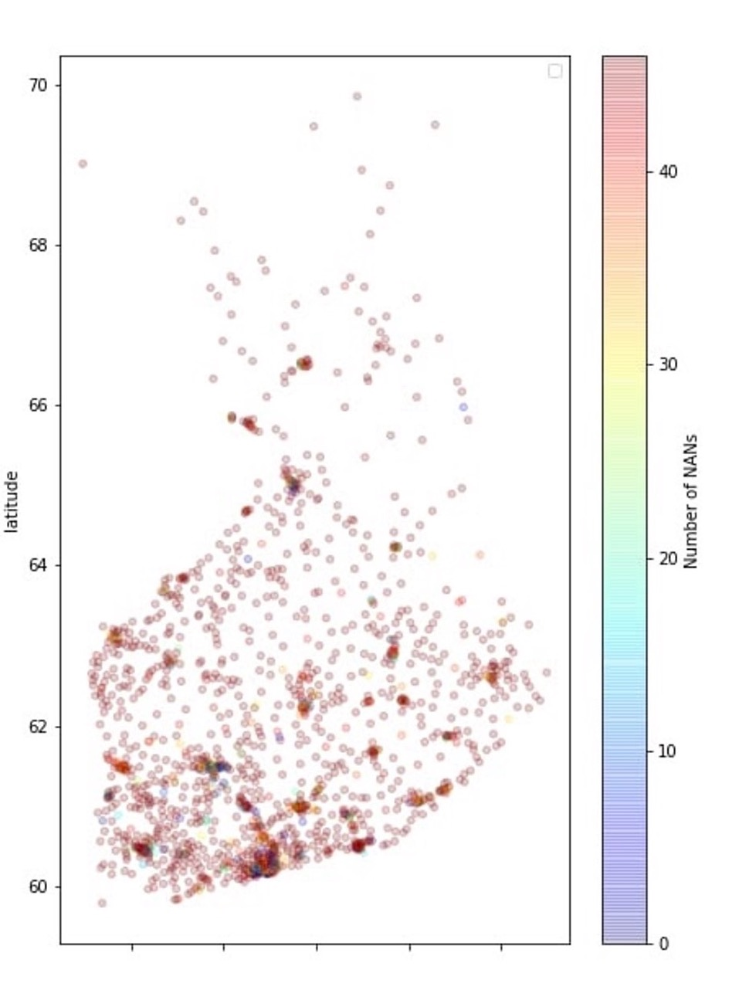
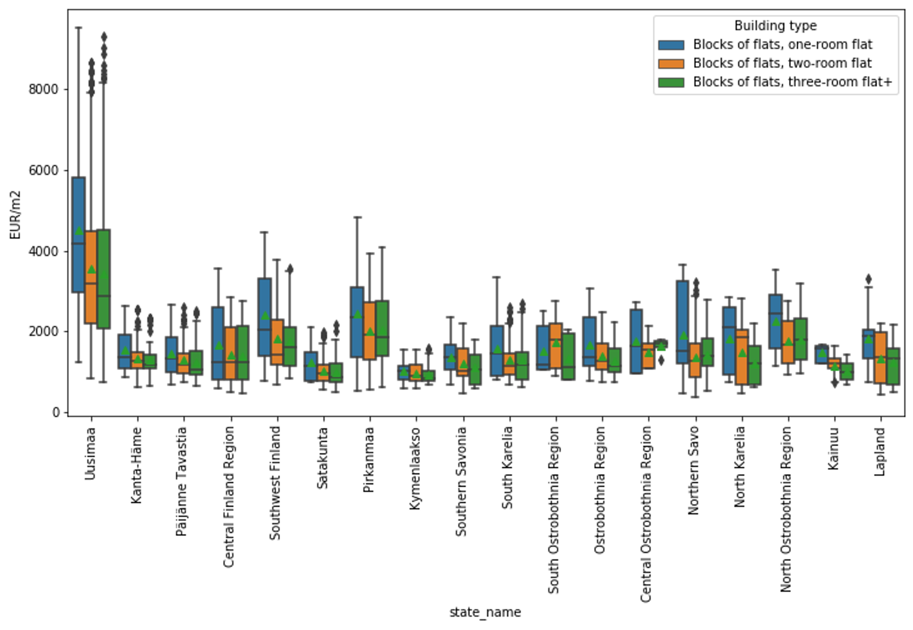



This page is under construction... I will keep updating the projects page, in the meanwhile, do check out the github links.

# Finnish Housing Market Prediction

***Key Concepts*** - *Exploratory Data Analysis, Data Visualisation, Clustering, Time Series Analysis, Facebook Prophet, SARIMAX*   
**Tools and Frameworks**- Python, Numpy, Pandas, Sklearn, FB Prophet, Heroku, Git, Latex

This project was a part of the course CS-C3250 Data Science Project 2021 under the supervision of  Prof. Jorma Laaksonen and Juha Vesanto, OP Financial Group's principal data scientist. The project's main objective was to gather related data from public sources and make a forecasting model of the development of house prices for the next four quarters.

We used data from the [Statistics Finland (Tilastokeskus)](https://tilastokeskus.fi/index_en.html) website. The dataset contained the prices of different house types for various postal codes throughout Finland. We preprocessed the data and performed exploratory data analysis to discover trends and patterns in housing prices during the past 46 quarters.

<!--  -->

**Collaborators**: [Ken Riipa](https://www.linkedin.com/in/kenriippa/), [Bruce Nguyen](https://www.linkedin.com/in/quan-possible/), [Taeyoung Kee](https://www.linkedin.com/in/taeyoung-kee-960550113/), [Duong Tran](https://www.linkedin.com/in/duong-tran-552522176/), Son Nguyen



 

# Predicting Helsinki's Humidity levels

Lorem ipsum dolor sit amet, consectetur adipiscing elit. Integer nec odio. Praesent libero. Sed cursus ante dapibus diam. Sed nisi. Nulla quis sem at nibh elementum imperdiet. Duis sagittis ipsum. Praesent mauris. Fusce nec tellus sed augue semper porta. Mauris massa. Vestibulum lacinia arcu eget nulla. Class aptent taciti sociosqu ad litora torquent per conubia nostra, per inceptos himenaeos. 

Curabitur sodales ligula in libero. Sed dignissim lacinia nunc. Curabitur tortor. Pellentesque nibh. Aenean quam. In scelerisque sem at dolor. Maecenas mattis. Sed convallis tristique sem. Proin ut ligula vel nunc egestas porttitor. Morbi lectus risus, iaculis vel, suscipit quis, luctus non, massa. Fusce ac turpis quis ligula lacinia aliquet. Mauris ipsum. Nulla metus metus, ullamcorper vel, tincidunt sed, euismod in, nibh. 


 

# IQ Growth Trends: Bayesian Analysis

Lorem ipsum dolor sit amet, consectetur adipiscing elit. Integer nec odio. Praesent libero. Sed cursus ante dapibus diam. Sed nisi. Nulla quis sem at nibh elementum imperdiet. Duis sagittis ipsum. Praesent mauris. Fusce nec tellus sed augue semper porta. Mauris massa. Vestibulum lacinia arcu eget nulla. Class aptent taciti sociosqu ad litora torquent per conubia nostra, per inceptos himenaeos. 

Curabitur sodales ligula in libero. Sed dignissim lacinia nunc. Curabitur tortor. Pellentesque nibh. Aenean quam. In scelerisque sem at dolor. Maecenas mattis. Sed convallis tristique sem. Proin ut ligula vel nunc egestas porttitor. Morbi lectus risus, iaculis vel, suscipit quis, luctus non, massa. Fusce ac turpis quis ligula lacinia aliquet. Mauris ipsum. Nulla metus metus, ullamcorper vel, tincidunt sed, euismod in, nibh. 


 

# Cassino Game

Cassino, a fishing card game, played by drawing cards and matching them with those on the deck with similar value or symbols. Made with Scala, using graphics from ScalaFX and tested with ScalaTest.

Lorem ipsum dolor sit amet, consectetur adipiscing elit. Integer nec odio. Praesent libero. Sed cursus ante dapibus diam. Sed nisi. Nulla quis sem at nibh elementum imperdiet. Duis sagittis ipsum. Praesent mauris. Fusce nec tellus sed augue semper porta. Mauris massa. Vestibulum lacinia arcu eget nulla. Class aptent taciti sociosqu ad litora torquent per conubia nostra, per inceptos himenaeos. 

Curabitur sodales ligula in libero. Sed dignissim lacinia nunc. Curabitur tortor. Pellentesque nibh. Aenean quam. In scelerisque sem at dolor. Maecenas mattis. Sed convallis tristique sem. Proin ut ligula vel nunc egestas porttitor. Morbi lectus risus, iaculis vel, suscipit quis, luctus non, massa. Fusce ac turpis quis ligula lacinia aliquet. Mauris ipsum. Nulla metus metus, ullamcorper vel, tincidunt sed, euismod in, nibh. 

<a class="github-button" href="https://github.com/atreyaray/CassinoGame" data-size="large" aria-label="Github Repo">Github Repo</a>

