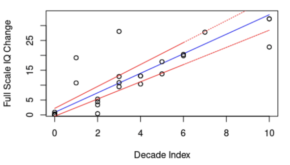



This page is under construction... I will keep updating the projects page, in the meantime, do check out the github links.

## Finnish Housing Market Prediction

**Key Concepts** - *Exploratory Data Analysis, Data Visualisation, Clustering, Time Series Analysis, Facebook Prophet, SARIMAX*   
**Tools and Frameworks**- *Python, Numpy, Pandas, Sklearn, FB Prophet, Heroku, Git, Latex*

This project was a part of the course CS-C3250 Data Science Project 2021 under the supervision of  Prof. Jorma Laaksonen and Juha Vesanto, OP Financial Group's principal data scientist. The project's main objective was to gather related data from public sources and make a forecasting model of the development of house prices for the next four quarters.

We used data from the [Statistics Finland (Tilastokeskus)](https://tilastokeskus.fi/index_en.html) website. The dataset contained the prices of different house types for various postal codes throughout Finland. We performed exploratory data analysis by visualising missing data and conducting time series analysis on the data to discover trends and patterns in housing prices during the past 46 quarters. Next we preprocessed the data by adding features such as latitude and longitude, followed by trying out different imputation methods for missing data.

For the prediction task we applied a couple of different time series methods. We used Prophet, an additive model utilising components such as trends, seasonality, holiday effect, and noise. Additionally we also made use of the Seasonal Autoregressive Integrated Moving Average eXogenous (SARIMAX) model using the `statsmodel` library. The final model which was deployed was an ensemble model pooling the results of both the SARIMAX and Prophet models. Based on the amount of missing data, we either used a model trained on individual postal code data, a grouped model from data of postal code clusters, or data from a postal code which was closest geographically.

<!--  -->

**Collaborators**: [Ken Riipa](https://www.linkedin.com/in/kenriippa/), [Bruce Nguyen](https://www.linkedin.com/in/quan-possible/), [Taeyoung Kee](https://www.linkedin.com/in/taeyoung-kee-960550113/), [Duong Tran](https://www.linkedin.com/in/duong-tran-552522176/), Son Nguyen



 

## IQ Growth Trends: Bayesian Analysis

**Key Concepts** - *Bayesian Analysis, Linear Regression, Monte Carlo Markov Chains, Convergence Diagnostics ( $\hat{R}$, $n_{\text{eff}}$ ), Performance Assessment (PSIS-LOO, $p_{\text{eff}}$ ), Prior Sensitivity Analysis, Data Preprocessing*   
**Tools and Frameworks**- *R, RMarkdown, Stan, Git*

This project was completed as a part of the course CS-E5710 Bayesian Data Analysis 2022. The main objectives of the report were to understand and apply the various steps in a Bayesian workflow. The project utilised the [Stan](https://mc-stan.org/) statistical programming language to perform Bayesian analysis on the IQ growth data. We used the [RMarkdown](https://rstudio.github.io/rmarkdown/) package to generate the report.

In this report we attempted to validate the [Flynn effect](https://en.wikipedia.org/wiki/Flynn_effect) with the help of [Full Scale IQ Change](https://github.com/owid/owid-datasets/tree/master/datasets/IQ%20Data%20-%20Pietschnig%20and%20Voracek%20(2015)) and [Schooling Index](https://frdelpino.es/investigacion/wp-content/uploads/2020/02/AHDI_1.1-1.xlsx) data. We explored the dependency between IQ change, time and change in average years of schooling in the population through Linear Regression. We investigated these dependencies both globally and per continent.

The trends in IQ were validated with a model that explored temporal dependency alone and a further model that factored in schooling level. We modeled the data with a pooled, separate and hierarchical model. These models explored the relationship between the passage of time and the development of IQ scores from the start of testing and the relationship between schooling level and the development of IQ scores from the start of testing.

**Collaborators**: [Aayush Kuckeria](https://www.linkedin.com/in/aayushkucheria/), and one other student from the course.


 

## Predicting Helsinki's Humidity levels

**Key Concepts** - *Multivariate Polynomial Regression, Linear Regression, Principal Component Analysis, Exploratory Data Analysis*   
**Tools and Frameworks**- *Python, Pandas, Numpy, Seaborn, Matplotlib, Git*

The objective of the project was to find the relation between humidity and different weather attributes using regression, and ultimately identify which attributes were the strongest humidity predictors. Another goal was to classify the weather as “dry” or “not dry” based on the given measurements. We used the KNN-algorithm to accomplish this task. One major issue which arose during the project was that the data set was high dimensional (17), which made the analysis complex and created obstacles in develop a reliable classification model and increase the risk of producing poor quality clusters. PCA was utilised to reduce the dimensionality of the data by creating a new set of attributes that better captured the variability of the data. With this new attribute set, the data became less sparse in the space it occupied, and as a result, better and more accurate predictions could be achieved.

The most elementary prediction method, multiple regression yielded the best results with an error of approximately 2.429%. As the value of the error rate was within an acceptable range, our model was fairly accurate in predicting the relative humidity of Helsinki. The weights of the different factors were also determined by the coefficients of the model which pointed out that the mean temperature and dewpoint temperature were the single largest factors affecting the relative humidity. Another noteworthy factor included the atmospheric pressure variable. With PCA, there was a drop in the accuracy of the classifier with an accuracy of around 69%. The drop in the accuracy was due to the fact that the cumulative variance described by the first two principal components was less than 50%.

**Collaborators**: [Long Nguyen](https://www.linkedin.com/in/longnguyen-13899/)


 

## Cassino Game

Cassino, a fishing card game, played by drawing cards and matching them with those on the deck with similar value or symbols. Made with Scala, using graphics from Scala Swing and tested with ScalaTest. The project used Scala Swing elements to create GUI elements 

 
 
 

 
<a class="github-button" href="https://github.com/atreyaray/CassinoGame" data-size="large" aria-label="Github Repo">Github Repo</a>

